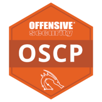

```

██╗░░██╗███████╗██╗░░░░░██╗░░░░░░█████╗░  ███╗░░██╗░█████╗░██╗░░░██╗██╗
██║░░██║██╔════╝██║░░░░░██║░░░░░██╔══██╗  ████╗░██║██╔══██╗██║░░░██║██║
███████║█████╗░░██║░░░░░██║░░░░░██║░░██║  ██╔██╗██║███████║╚██╗░██╔╝██║
██╔══██║██╔══╝░░██║░░░░░██║░░░░░██║░░██║  ██║╚████║██╔══██║░╚████╔╝░██║
██║░░██║███████╗███████╗███████╗╚█████╔╝  ██║░╚███║██║░░██║░░╚██╔╝░░██║
╚═╝░░╚═╝╚══════╝╚══════╝╚══════╝░╚════╝░  ╚═╝░░╚══╝╚═╝░░╚═╝░░░╚═╝░░░╚═╝
```

I worry that things might break, so I break them to confirm so.

---

**Courses that taught me how to make things**:

- CS50
- FullStack Open

---

**Courses that taught me how to (and why it is important to) break things**:

- Cyber Security Base on MOOC.fi
- TryHackMe Paths:
    - Pre-Security
    - Complete Beginner
    - Jr Penetration Tester
    - Offsensive Pentesting
- Offensive Security:
    - PEN-200

---

**Qualification**:



---

**CTF**:

TryHackMe | HackTheBox
--- | ---
 | 
Rank 1832th | Rank 548th

(as of Dec 2022)

---

**DMOJ**:

Sometimes I solve programming puzzles on [DMOJ.ca](https://dmoj.ca/user/tera_si) as well, mostly using C.

But nowadays I am focusing on security stuffs.

---

Profile picture created with 「뒤를 보는 픽크루」on picrew.me
